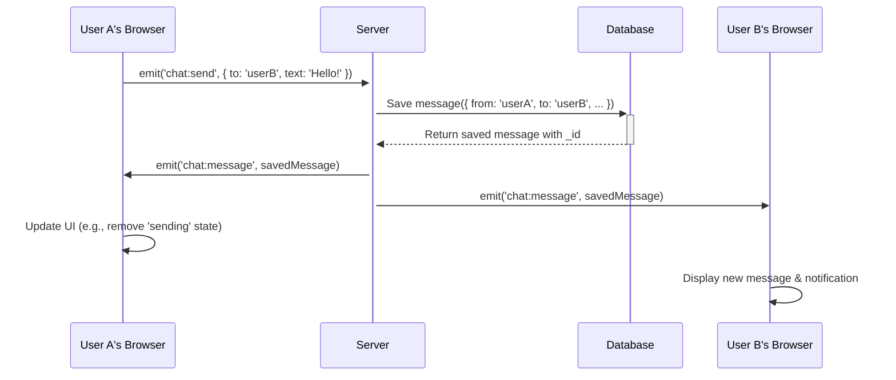

# SkillSwap Realtime (Chat + Calls)

This project is a full-stack application designed to facilitate real-time communication and social interaction. It features a robust backend built with Node.js, Express, and MongoDB, and supports features like user authentication, friend management, real-time chat, 1:1 video calls, and a community discussion forum.

## Core Features

*   **User Authentication**: Secure user registration and login using JSON Web Tokens (JWT), with support for OTP-based verification.
*   **User Profiles**: Customizable user profiles with profile pictures, skills, and certificates.
*   **Friend System**: Send, accept, reject, and cancel friend requests. All interactions like chat and calls are restricted to friends only.
*   **Real-time Chat**: 1:1 private chat between friends with message history, read receipts, and media sharing, powered by Socket.IO.
*   **Video Calls**: 1:1 video calls using WebRTC for peer-to-peer connection, with signaling handled by Socket.IO. Includes features like shared notes and a whiteboard.
*   **Discussion Forum**: A public forum for users to create topics, post comments, vote on discussions, and search for content.
*   **Call Ratings**: A system for users to rate their call experience after a session ends.
*   **Cloud Media Storage**: Integrates with Cloudinary for efficient storage and delivery of profile pictures and chat media.

## Tech Stack

*   **Backend**: Node.js, Express.js, MongoDB (with Mongoose), Socket.IO, JWT, Cloudinary
*   **Database**: MongoDB
*   **Real-time Engine**: Socket.IO
*   **Deployment**: Docker support for backend services (API, MongoDB, coturn).

## Getting Started

### Prerequisites
*   Node.js and npm
*   React and Vite (for frontend)
*   MongoDB
*   A Cloudinary account for media storage
*   A GIPHY API key for GIF integration (optional)
*   Docker and Docker Compose (optional)

### Local Installation

**Backend Setup:**
1.  Navigate to the `backend` directory: `cd backend`
2.  Create a `.env` file from the example: `cp .env.example .env`
3.  Fill in the required environment variables in `.env`. See the **Environment Variables** section below for details.
4.  Install dependencies: `npm install`
5.  Start the development server: `npm run dev`

**Frontend Setup:**
1.  Navigate to the `frontend` directory: `cd frontend`
2.  Create a `.env` file for your GIPHY API key: `echo "VITE_GIPHY_API_KEY=your_key_here" > .env`
3.  Install dependencies: `npm install`
4.  Start the development server: `npm run dev`
5.  Open your browser and go to `http://localhost:5173`.

### Environment Variables
| Variable                  | Location | Description                                                                                              |
| ------------------------- | -------- | -------------------------------------------------------------------------------------------------------- |
| `MONGODB_URI`             | Backend  | The connection string for your MongoDB database.                                                         |
| `ACCESS_TOKEN_SECRET`     | Backend  | A long, random string used to sign short-lived JWT access tokens.                                        |
| `REFRESH_TOKEN_SECRET`    | Backend  | A long, random string used to sign long-lived JWT refresh tokens.                                        |
| `CLOUDINARY_CLOUD_NAME`   | Backend  | Your Cloudinary cloud name for media uploads.                                                            |
| `CLOUDINARY_API_KEY`      | Backend  | Your Cloudinary API key.                                                                                 |
| `CLOUDINARY_API_SECRET`   | Backend  | Your Cloudinary API secret.                                                                              |
| `VITE_GIPHY_API_KEY`      | Frontend | Your GIPHY API key, used for fetching and displaying GIFs in the chat. Prefixed with `VITE_` for Vite. |

### Docker (Optional)
If you have Docker installed, you can easily run the backend services.
```bash
cd backend
docker compose up -d
```
This command will start the API server, a MongoDB instance, and a coturn server for WebRTC.

## API Architecture

The backend is organized into modular routes, each handling a specific domain of the application's functionality. All protected routes use JWT-based authentication middleware.

### Authentication (`/api/users`)
Handles user registration, login, and session management.
*   `POST /request-register-otp`: Initiates registration by sending an OTP to the user's email.
*   `POST /verify-register-otp`: Completes registration by verifying the OTP.
*   `POST /login`: Authenticates a user and returns JWTs.
*   `GET /refresh`: Provides a new access token using a refresh token.
*   `GET /me`: Fetches the profile of the currently logged-in user.

### User Profiles (`/api/profile`)
Manages user profile data.
*   `POST /create`: Creates a new user profile.
*   `PUT /update`: Updates the current user's profile.
*   `PUT /profile-picture`: Updates the user's profile picture via Cloudinary.
*   `GET /user/:userId`: Fetches the profile of a specific user.

### Friends (`/api/friend`)
Manages the social graph.
*   `POST /request`: Sends a friend request to another user.
*   `POST /accept`: Accepts a pending friend request.
*   `POST /reject`: Rejects a pending friend request.
*   `POST /unfriend`: Removes a user from the friends list.
*   `GET /list`: Retrieves the current user's friends list.
*   `GET /notifications`: Fetches incoming friend requests.

### Chat (`/api/chat`)
Handles messaging between friends.
*   `GET /history`: Retrieves paginated chat history with a friend.
*   `POST /sendMedia`: Sends an image or file attachment in a chat.
*   `GET /search`: Searches for text within a chat conversation.
*   `POST /clear/:peerId`: Clears the chat history for the current user (soft delete).
*   `POST /read`: Marks a batch of messages as read.
*   `GET /unread`: Gets a count of all unread messages for the user.
*   `DELETE /message/:messageId`: Deletes a message (sender only).
*   Real-time messages are sent and received via Socket.IO events (`chat:message`).

### Calls (`/api/calls`)
Manages the lifecycle of 1:1 video call sessions.
*   `POST /`: Creates a new call session between two friends.
*   `GET /:id`: Fetches details of a specific call session.
*   `POST /:id/end`: Marks a call session as ended.
*   `POST /:id/notes`: Creates or updates shared notes for the call.

### Call Ratings (`/api/ratings`)
Collects user feedback on call quality.
*   `POST /submit`: Submits a rating and feedback for a completed call.
*   `GET /user/:userId`: Retrieves all ratings for a specific user.
*   `GET /average/:userId`: Calculates the average rating for a user.

### Discussions (`/api/discuss`)
Powers the community forum.
*   `POST /`: Creates a new discussion topic.
*   `GET /`: Fetches all discussion topics.
*   `GET /search`: Searches for discussions by title, content, or tags.
*   `POST /:id/comments`: Adds a comment to a discussion.
*   `POST /:id/vote`: Upvotes a discussion.

### Call Summary (`/api/summary`)
Provides a post-call summary.
*   `GET /:id`: Generates a summary for a call session, including notes and chat highlights.

## Frontend Architecture

The frontend is a single-page application built with **React** and **Vite**. It uses a component-based architecture to create a modular and maintainable user interface.

*   **Styling**: Styled with **TailwindCSS** and the **DaisyUI** component library for a utility-first approach and consistent design.
*   **State Management**: Primarily uses React hooks (`useState`, `useEffect`, `useCallback`) for managing local component state.
*   **Routing**: `react-router-dom` is used for client-side routing, enabling navigation between pages like Friends, Chat, and Calls without full page reloads.
*   **API Communication**: **Axios** is configured as the HTTP client for making requests to the backend REST API. An interceptor is used to automatically attach the JWT access token to authorized requests.
*   **Key Components**:
    *   `ChatWindow.jsx`: The core of the real-time chat experience. It manages socket connections, message history, sending/receiving messages, typing indicators, and UI for GIFs, emojis, and file uploads.
    *   `CallInviteModal.jsx`: A modal that handles incoming and outgoing call invitations, providing users with options to accept or reject calls.

## Real-time Event Model (Socket.IO)

Socket.IO is central to the real-time features of the application. When a user connects, they are authenticated via their JWT and join a private room (`user:<userId>`). This allows the server to send targeted events to specific users.

### Client Emits (Events sent from Frontend to Backend)
| Event               | Payload                  | Description                                                              |
| ------------------- | ------------------------ | ------------------------------------------------------------------------ |
| `chat:join`         | `peerId`                 | Informs the server that the user is actively viewing a chat.             |
| `chat:leave`        | `peerId`                 | Informs the server the user has left a chat view.                        |
| `chat:send`         | `{ peerId, context }`    | Sends a new text message to a peer.                                      |
| `user:typing`       | `{ to: peerId }`         | Notifies the server that the user is typing to a peer.                   |
| `user:typing:stop`  | `{ to: peerId }`         | Notifies the server that the user has stopped typing.                    |
| `call:initiate`     | `{ to: peerId }`         | Requests to start a new video call with a peer.                          |
| `call:accept`       | `{ callId }`             | Accepts an incoming call invitation.                                     |
| `call:reject`       | `{ callId }`             | Rejects an incoming call or cancels an outgoing one.                     |

### Server Emits (Events sent from Backend to Frontend)
| Event             | Payload                  | Description                                                              |
| ----------------- | ------------------------ | ------------------------------------------------------------------------ |
| `chat:message`    | `Message` object         | Delivers a new message (text or media) to the sender and receiver.       |
| `chat:cleared`    | `{ peerId }`             | Notifies the user's clients that their view of a chat has been cleared.  |
| `user:typing`     | `{ from: userId }`       | Relays a typing indicator to the relevant user.                          |
| `user:typing:stop`| `{ from: userId }`       | Relays that a user has stopped typing.                                   |
| `user:online`     | `userId`                 | Broadcasts when a user connects.                                         |
| `user:offline`    | `userId`                 | Broadcasts when a user disconnects.                                      |
| `call:incoming`   | `{ from, callId }`       | Notifies a user of an incoming call invitation.                          |
| `call:accepted`   | `{ sessionId, peerId }`  | Confirms a call was accepted and provides the session ID to join.        |
| `call:rejected`   | -                        | Informs the caller that their invitation was rejected.                   |
| `call:timeout`    | -                        | Informs both users that a call invitation has expired.                   |

## Application Workflows

This section provides visual diagrams to illustrate key user flows within the application. These are rendered using Mermaid syntax.

### Chat Message Flow

The following sequence diagram shows the process of one user sending a chat message to another, including the client-side events, server-side processing, and database interaction.



## System Design Notes

*   **Security**: API endpoints and Socket.IO connections are protected using JWTs. Server-side logic ensures that sensitive actions (like chatting or calling) can only be performed between users who are friends.
*   **Real-time Communication**: Socket.IO is used for both chat messaging and WebRTC signaling. Users are joined to their own "room" (`user:<userId>`) to allow for direct and private event emission.
*   **Scalability**: For scaling the Socket.IO server across multiple instances, the Socket.IO Redis Adapter can be implemented. This will allow broadcasting events across all clients, regardless of which server instance they are connected to.
*   **Server-Side Recording**: The functionality for server-side recording of calls is currently a stub (`services/recorder.js`). For a production implementation, this could be integrated with a media server like Mediasoup or Janus.
*   **Error Handling**: The application uses a combination of `try...catch` blocks in async route handlers and a centralized error-handling middleware to manage exceptions and provide consistent error responses.
## Security Considerations

Security is a critical aspect of this application. The following principles are enforced:
*   **Authentication**: User authentication is managed via short-lived JWT access tokens and long-lived refresh tokens, which are stored securely in `HttpOnly` cookies.
*   **Authorization**: All protected API endpoints and socket events require a valid JWT. Server-side logic consistently verifies that users are friends before allowing actions like messaging or calling.
*   **Password Security**: Passwords are never stored in plaintext. They are hashed using a strong algorithm like Argon2 or bcrypt before being saved to the database.
*   **Input Validation**: All incoming data from clients is validated and sanitized on the backend to prevent common vulnerabilities like XSS and NoSQL injection.

For a detailed checklist of security measures implemented and under consideration, please refer to the `authentication.md` document.

## Testing

This project uses **Jest** and **React Testing Library** for frontend testing. The strategy focuses on covering critical user paths and component states.

*   **Unit/Component Tests**: Verify individual components render correctly based on props and state (e.g., loading, error, empty).
*   **Integration Tests**: Test user flows, such as sending a message, searching history, or interacting with a call modal.

To run the test suite, navigate to the `frontend` directory and run: `npm test`

## Contributing

We welcome contributions! To ensure consistency and high-quality code, please review our project guidelines before getting started. The `best_practices.md` file contains detailed information on:
*   Code style and naming conventions
*   Common architectural patterns
*   The project's test strategy
*   Do's and Don'ts for development

## Roadmap & Future Features

The following features are planned for future releases:
*   **Message Enhancements**: Grouping messages by date, image lightbox viewer, and read receipts.
*   **Improved UX**: Drag-and-drop file uploads, pasting images directly into chat, and keyboard shortcuts (e.g., `Ctrl+K` for search).
*   **Call Features**: Group video calls and advanced whiteboard tools.
*   **Server-Side Recording**: A full implementation using a media server like Mediasoup.
